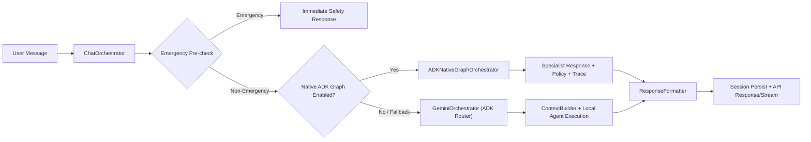

# Multi-Agent Orchestration

This directory contains the runtime orchestration stack for DovvyBuddy chat.

Current runtime supports two ADK paths:

1. ADK-native coordinator + specialists graph (`ENABLE_ADK_NATIVE_GRAPH=true`)
2. Legacy ADK router + existing local specialist execution (`ENABLE_ADK_NATIVE_GRAPH=false`)

Both paths are managed from `ChatOrchestrator`.

## Runtime Flow

## Core Components

### `orchestrator.py` (`ChatOrchestrator`)

- Main controller for `/api/chat` and `/api/chat/stream`.
- Enforces emergency pre-check before normal routing.
- Uses DB-backed session continuity (`session_id`).
- Adds structured metadata:
  - `route_decision`
  - `safety_classification`
  - `policy_enforced`
  - `citations`
  - `quota_snapshot`

### `../adk/graph_orchestrator.py` (`ADKNativeGraphOrchestrator`)

- ADK-native multi-agent graph:
  - `dovvy_orchestrator` (coordinator)
  - `trip_specialist`
  - `certification_specialist`
  - `general_retrieval_specialist`
  - `safety_specialist`
- Uses shared ADK tool contracts in `../adk/tools.py`:
  - `rag_search_tool`
  - `session_context_tool`
  - `safety_classification_tool`
  - `response_policy_tool`
- Emits structured stream events: `safety`, `route`, `token`, `citation`, `final`, `error`.

### `gemini_orchestrator.py` (`GeminiOrchestrator`)

- Legacy ADK function-calling router used during staged rollout/fallback.
- Routes semantically to specialist routes:
  - `trip_specialist`
  - `certification_specialist`
  - `general_retrieval_specialist`
  - `safety_specialist`
- No non-emergency keyword routing in this path.

### `emergency_detector_hybrid.py`

- Keeps deterministic emergency interception precedence.
- Emergency path bypasses normal specialist routing.

### `response_formatter.py`

- Final response cleanup and user-facing tone normalization.
- Runs after specialist output in both native and legacy paths.

## Quota and Cost Integration

All orchestration paths share process-level quota accounting (`app/core/quota_manager.py`).

- Buckets:
  - `text_generation`
  - `embedding`
- Enforced controls:
  - RPM
  - TPM
  - RPD (fail-fast on daily exhaustion)
- Quota exhaustion returns a graceful system response with quota metadata.

## Streaming Contract

`ChatOrchestrator.stream_chat()` powers `/api/chat/stream` SSE events:

1. `route` (when available)
2. `safety`
3. `token` (progressive model output when native graph is enabled)
4. `citation` (zero or more)
5. `final` (always terminal success payload)
6. `error` (terminal failure payload)

## File Guide

- `orchestrator.py`: Top-level chat orchestration and fallback logic.
- `gemini_orchestrator.py`: Legacy ADK routing bridge.
- `context_builder.py`: Legacy context assembly path.
- `response_formatter.py`: Final response normalization.
- `types.py`: Request/response/session contracts.
