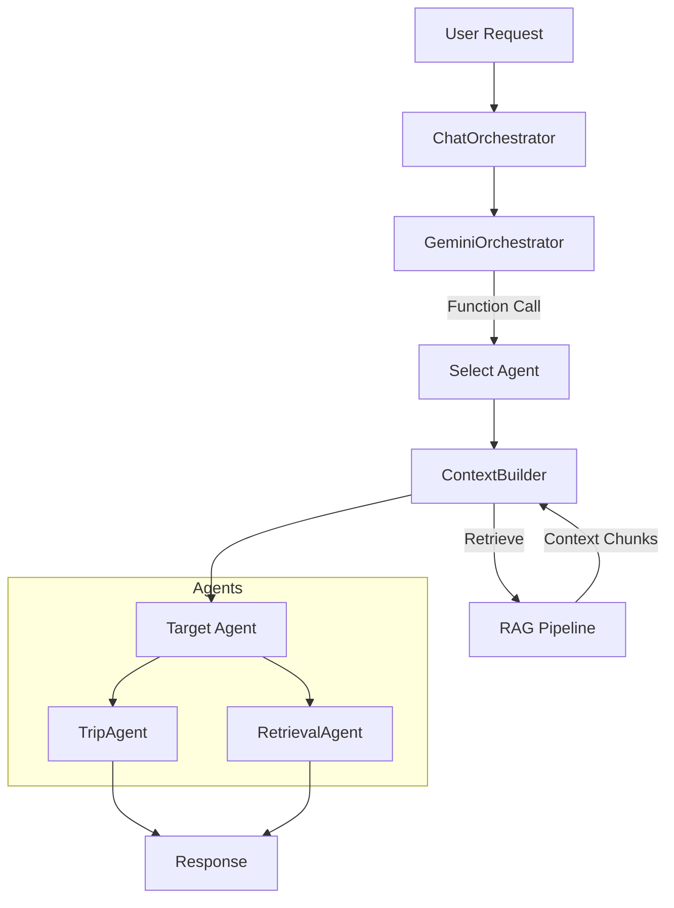

# Multi-Agent RAG Orchestration

This directory contains the core logic for DovvyBuddy's orchestration layer, designed following the **Google Agent Development Kit (ADK)** principles. It handles user intent recognition, semantic routing, RAG context retrieval, and agent execution.

## Architecture Overview

The system uses a **Router-Solver** pattern where a specialized model routes user requests to the most appropriate agent.

## Core Components

### 1. `GeminiOrchestrator` (The Router)
- **Role**: Semantic Router
- **Model**: `gemini-2.5-flash-lite` (Fast, cost-effective)
- **Mechanism**: **Function Calling**. Agents are defined as "tools" (e.g., `trip_planner`, `knowledge_base`). The model analyzes the user query and outputs a function call, which we map to an agent.
- **Why**: Eliminates fragile keyword matching and allows semantic understanding of intent (e.g., "I want to see Nemo" -> `trip_planner`).

### 2. `ContextBuilder` (The RAG Engine)
- **Role**: Context Aggregator
- **Responsibility**: 
  - Retrieves relevant documents from the vector database (`VectorRetriever`).
  - Fetches user profile data and conversation history.
  - Packages everything into a standardized `AgentContext` object.
- **RAG Flow**: 
  1. User Query -> Embedding
  2. Vector Search -> Top K Chunks
  3. Filter by Similarity (>0.5)
  4. Formatted Context -> Passed to Agent

### 3. Agents (`TripAgent`, `RetrievalAgent`)
- **Role**: The Solvers
- **Structure**: Inherit from `BaseAgent`.
- **Input**: `AgentContext` (contains Query + History + RAG Data).
- **Output**: `AgentResult` (Response + Metadata).
- **Prompt Engineering**: Each agent has a specialized system prompt to enforce:
  - **Strict RAG Compliance**: "Only use facts from the provided context."
  - **Persona**: Enthusiastic, professional, safety-conscious.
  - **Output Format**: Bullet points for lists, clear separation of facts.

### 4. Safety Guardrails (Pre-Processing)
Before any request reaches the Router or Agents, it passes through specialized safety detectors. These are **NOT** part of the RAG retrieval loop but act as critical interceptors.

#### `EmergencyDetector` (`emergency_detector_hybrid.py`)
- **Purpose**: Detect active medical emergencies (e.g., "I have chest pain after diving").
- **Mechanism**: **Hybrid Approach**
  1. **Keyword Fast-Fail**: Checks for symptom keywords ("pain", "numbness") + first-person context ("I", "my") + dive context.
  2. **LLM Validation**: If ambiguous (e.g., "What is chest pain?"), a lightweight LLM clarifies if it's an emergency or educational query.
- **Action**: If triggered, immediately returns a hard-coded safety response with emergency contacts (DAN, MERS), bypassing the entire RAG system.

#### `MedicalQueryDetector` (`medical_detector.py`)
- **Purpose**: Classify general medical questions that aren't emergencies.
- **Mechanism**: Lightweight classification.
- **Action**: Tags the query so the Orchestrator can route it to `knowledge_base` with a "Medical Advice Disclaimer" instruction (or blocks it depending on configuration).

## Conversational Engagement Strategy

To keep the conversation interesting and ongoing while remaining grounded, we employ specific strategies in the Agent Prompts and Orchestration logic:

### 1. Proactive Lead Capture (The "Hook")
Every Agent response (especially `TripAgent`) is designed to end with a **forward-looking question** or **Call to Action (CTA)**.
- *Example*: "I can help you plan this! When are you thinking of going?"
- *Why*: This prevents dead-end answers and encourages the user to continue the dialogue, moving them down the funnel.

### 2. "Wrong vs Right" Prompting
We use "Few-Shot" prompting techniques with explicit negative constraints to prevent generic hallucinations.
- **Constraint**: "Do not use phrases like 'shallow coral gardens' unless specifically named."
- **Example**: 
    - ❌ *Wrong*: "Tioman has deep pinnacles."
    - ✅ *Right*: "Sites like **Tiger Reef** offer deep pinnacles (9-25m)..."

### 3. Contextual Continuity
The system maintains a sliding window of conversation history (last 10 messages).
- **Mechanism**: The `GeminiOrchestrator` sees the history to understand partial queries (e.g., "How deep is it?" refers to the previously discussed site).
- **ContextBuilder**: Passes recent history to the Agent so it can reference previous topics naturally.

## File Structure

- `orchestrator.py`: Main entry point. Coordinates the pipeline.
- `gemini_orchestrator.py`: Implementation of Gemini Function Calling for routing.
- `context_builder.py`: Logic for building `AgentContext` (RAG + History).
- `types.py`: Shared data models (`IntentType`, `SessionState`, `AgentContext`).
- `response_formatter.py`: Post-processing (sanity checks, formatting).

## Key Workflows

### Trip Planning Flow
1. **User**: "Where can I dive in Tioman?"
2. **Router**: Detects `trip_planner` intent.
3. **Context**: Retrievers Tioman destination guide.
4. **TripAgent**:
   - Reads RAG context (sites: Tiger Reef, Renggis).
   - Generates response listing specific sites.
   - Appends Hook: "When are you going?"

### Knowledge Retrieval Flow
1. **User**: "Is it safe to fly after diving?"
2. **Router**: Detects `knowledge_base` intent.
3. **Context**: Retrieves safety guidelines.
4. **RetrievalAgent**:
   - Synthesizes safety rules from context.
   - Formats with clear warnings.
